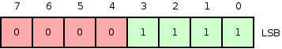
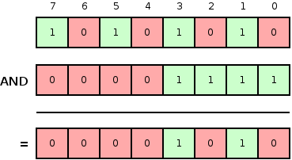
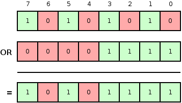
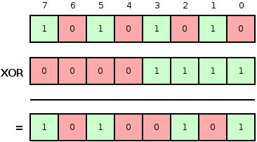
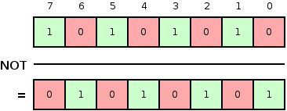

## What is Minuteman?

Minuteman provides fast analytics using Redis as a backend.
Uses bitwise operations to provide complex data analysis and reporting.

_Wikipedia_: Minutemen were members of teams from Massachusetts that were
well-prepared
militia companies of select men from the American colonial partisan militia
during the American Revolutionary War. _They provided a highly mobile, rapidly
deployed force that allowed the colonies to respond immediately to war threats,
hence the name._

## What's the idea behind it?

It's all about the bytes, well, actually it's all about Redis.
Since Redis 2.6 bit operations are part of this great db and that inspired
different people. Thanks to them I've built Minuteman:

* http://blog.getspool.com/2011/11/29/fast-easy-realtime-metrics-using-redis-bitmaps/
* http://amix.dk/blog/post/19714
* http://en.wikipedia.org/wiki/Bit_array

## Getting started

### How about complex operations?

### What can I do if I want to join it with my User table?

## Minuteman explained

Let's go through bit operations once again:

<figure>
  
  <figcaption> This is the number 15 represented in 8 bits, the key concept of this.  But also we can see that as bits 0 to 3 are marked. Ignoring 0 we also can see this as user_id 1 to 3 are marked </figcaption>
</figure>

Having our users represented as marked bits gives us access to bit operations:

### AND - `&`

<figure>
  
  <figcaption> Now let's imagine our first bit array represents users who get an email invitation and the other set represents the users who bought our product. Then we can find out the intersection of them.  </figcaption>
</figure>

### OR - `|`

<figure>
  
  <figcaption> We can imagine the same but joining two sets to do another operation afterwards </figcaption>
</figure>

### XOR - `^`

<figure>
  
  <figcaption> The exclusive or aka XOR will behave like OR but ignoring the common bits.  </figcaption>
</figure>

### NOT - `~`

<figure>
  
  <figcaption> This will reverse the marked bits </figcaption>
</figure>

Pictures from <small>http://www.micahcarrick.com/tutorials/avr-microcontroller-tutorial/avr-c-programming.html</small>

